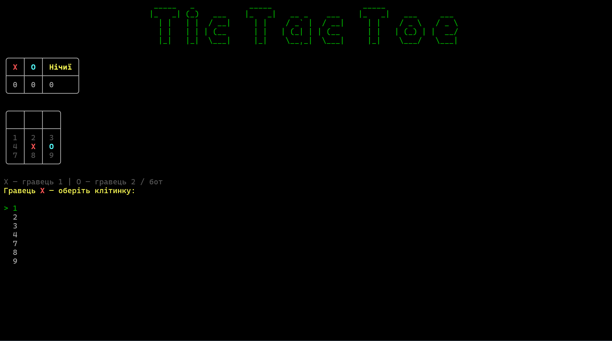

# 🎮 Tic Tac Toe

Console Tic Tac Toe game developed in C# as part of the C# course.

## 📝 Description

This is a console-based Tic Tac Toe game with a colorful interface created using Spectre.Console.

The game supports two modes:

- 👥 Player vs Player
- 🤖 Player vs Computer

The application also keeps track of wins for X, wins for O, and draws.

## 🛠️ Technologies

- C#
- .NET 9
- Spectre.Console

## 🖼️ Demo



## 🚀 How to Run

Clone the repository:

```bash
git clone https://github.com/milittary/Homework.git